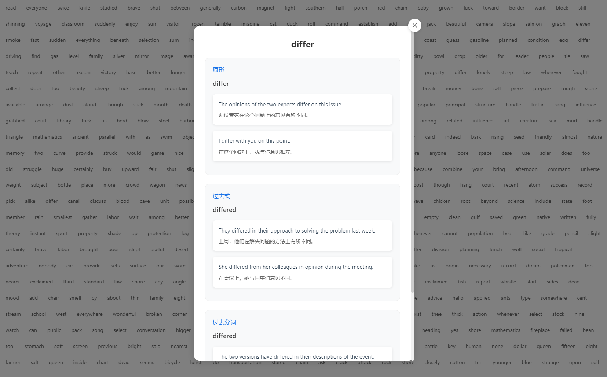

# 全屏单词

一个使用 Vue.js 和 Express.js 构建的全屏单词学习应用。前端展示随机单词，点击单词后显示详细释义和例句。后端使用 OpenRouter API 获取单词信息。

## 特性

*   **全屏单词展示：** 在浏览器中以全屏模式展示随机生成的单词。
*   **单词释义：** 点击单词后，弹出窗口显示该单词的详细释义和例句。
*   **OpenRouter API 支持：** 使用 OpenRouter API 获取单词的释义和例句信息。
*   **本地缓存：** 将已查询的单词信息缓存到本地文件，避免重复请求 API。
*   **响应式设计：** 适应不同屏幕尺寸，提供最佳的用户体验。

## 预览




## 快速开始

### 前置条件

在开始之前，请确保你已经安装了以下软件：

*   [Node.js](https://nodejs.org/) (推荐 18+ 版本)
*   [npm](https://www.npmjs.com/) (通常会随 Node.js 一起安装)
*   一个 OpenRouter API Key (详见 [OpenRouter](https://openrouter.ai/))

### 部署步骤

1.  **克隆代码仓库：**

    ```bash
    git clone <你的代码仓库地址>
    cd <项目目录>
    ```

2.  **配置环境变量：**

    *   在项目根目录下创建一个 `.env` 文件。
    *   添加你的 OpenRouter API Key 到 `.env` 文件中：

        ```
        OPENROUTER_API_KEY=<你的 OpenRouter API Key>
        ```

    *   **可选：** 如果你使用了代理，也请在 `.env` 文件中设置代理地址：

        ```
        HTTP_PROXY=http://127.0.0.1:7890
        ```

        请确保将 `http://127.0.0.1:7890` 替换为你实际的代理地址。

3.  **安装后端依赖：**

    ```bash
    cd server
    npm install
    ```

4.  **运行后端服务：**

    ```bash
    npm run start
    ```

    或者

    ```bash
    node index.js
    ```

    后端服务默认运行在 `http://localhost:3000`。

5.  **安装前端依赖：**

    打开新的终端窗口，执行以下命令：

    ```bash
    cd ../frontend
    npm install
    ```

6.  **运行前端应用：**

    ```bash
    npm run dev
    ```

    前端应用默认运行在 `http://localhost:5173` (端口号可能会变化，请参考终端输出)。

7.  **打开浏览器：**

    在浏览器中访问前端应用的地址（例如 `http://localhost:5173`），即可开始使用全屏单词应用。

### 目录结构

```
全屏单词/
├── .git/                 # Git 仓库信息
├── .gitignore            # Git 忽略文件配置
├── data/                 # 缓存的单词数据 (JSON 文件)
├── frontend/             # Vue.js 前端代码
│   ├── .gitignore          # 前端 Git 忽略文件配置
│   ├── jsconfig.json       # JavaScript 配置
│   ├── package.json        # 前端依赖和脚本
│   ├── public/             # 公共资源
│   ├── src/                # 前端源代码
│   │   ├── App.vue         # 主组件
│   │   ├── main.js         # 入口文件
│   │   └── ...
│   ├── vite.config.js    # Vite 配置文件
│   └── ...
├── server/               # Express.js 后端代码
│   ├── .gitignore          # 后端 Git 忽略文件配置
│   ├── index.js            # 后端入口文件
│   └── package.json        # 后端依赖和脚本
├── README.md             # 说明文档
└── ...
```

### 配置说明

*   `.env` 文件：用于配置 OpenRouter API Key 和代理设置。
*   `server/index.js`：后端入口文件，处理 API 请求和数据缓存。
*   `frontend/vite.config.js`：前端构建工具 Vite 的配置文件。
*   `frontend/src/App.vue`：前端主组件，负责单词展示和单词信息弹窗。

## 贡献

欢迎提交 Pull Request 来改进本项目！请先创建一个新的分支，进行修改后提交 PR。

## 许可证

本项目使用 MIT 许可证，详情请见 [LICENSE](LICENSE) 文件。

## 联系方式

如有任何问题或建议，请通过以下方式联系我：

*   [你的邮箱地址]
*   [你的 GitHub 个人主页]

感谢你的使用！
```

**注意事项：**

*   请将 `<你的代码仓库地址>`、`<你的 OpenRouter API Key>`、`[你的邮箱地址]` 和 `[你的 GitHub 个人主页]` 替换成你实际的信息。
*   如果你的项目包含 `LICENSE` 文件，请确保链接正确。 如果没有，可以考虑添加一个，并在 `README.md` 中引用。
*   根据项目的实际情况，可能还需要添加更详细的配置说明和使用示例。
*   请添加一些项目截图或演示链接，让用户更直观地了解项目。
*   根据你的实际情况修改目录结构部分。
*   如果你有更详细的部署或使用说明，也请补充到文档中。
*   请注意OpenRouter 的使用条款和速率限制，确保你的应用符合要求。
*   确保 `.env` 文件添加到 `.gitignore` 中，避免 API Key 泄露。
*   如果需要，添加常见问题解答 (FAQ) 部分。
*   考虑添加贡献者指南，说明如何参与项目的开发。