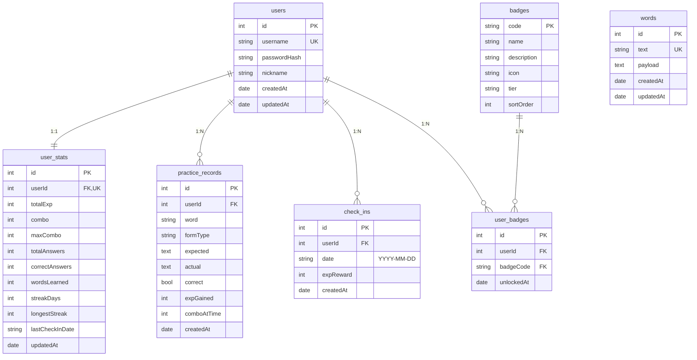

# 数据库表结构 (SQLite)

> 权威定义见 `server/src/**/entities/*.entity.ts`，启动时由 TypeORM `synchronize: true` 自动建表，文件位于 `server/data.sqlite`。本文档对所有表、字段、关系做整体说明，便于查阅。

## 关系总览



---

## `users` — 账号
**文件**：`server/src/users/entities/user.entity.ts`

| 字段 | 类型 | 约束 | 说明 |
| --- | --- | --- | --- |
| `id` | integer | PK, auto-increment | |
| `username` | varchar(32) | **unique** index | 3–32 位，正则 `^[a-zA-Z0-9_-]+$` |
| `passwordHash` | varchar(100) | NOT NULL | bcryptjs，rounds = 10 |
| `nickname` | varchar(64) | nullable | 显示名，默认等于 username |
| `createdAt` | datetime | 自动 | TypeORM `@CreateDateColumn` |
| `updatedAt` | datetime | 自动 | TypeORM `@UpdateDateColumn` |

**关联**
- `1:1 user_stats`（通过 user_stats.userId）
- `1:N practice_records / check_ins / user_badges`

---

## `user_stats` — 用户成长指标（每用户一行）
**文件**：`server/src/users/entities/user-stats.entity.ts`

| 字段 | 类型 | 默认 | 说明 |
| --- | --- | --- | --- |
| `id` | integer | PK | |
| `userId` | integer | FK→users.id, ON DELETE CASCADE | one-to-one |
| `totalExp` | integer | 0 | 累计 EXP，等级由 `common/level.util.ts` 计算 |
| `combo` | integer | 0 | 当前连击；答错或重复答对不变化时清零 |
| `maxCombo` | integer | 0 | 历史最高连击 |
| `totalAnswers` | integer | 0 | 累计答题次数（不含重复答对、不含 `_view_` marker） |
| `correctAnswers` | integer | 0 | 累计答对次数 |
| `wordsLearned` | integer | 0 | 累计学习的不同单词数（首次 markLearned 时 +1） |
| `streakDays` | integer | 0 | 当前连续打卡天数 |
| `longestStreak` | integer | 0 | 历史最长连击天数 |
| `lastCheckInDate` | varchar(10) | nullable | 最近一次打卡日期 `YYYY-MM-DD`（服务器本地时区） |
| `updatedAt` | datetime | 自动 | |

> 设计说明：所有等级/进度都是从 `totalExp` 实时换算的，不缓存。`combo` 是事务性的，存储有点尴尬但简化了实现。

---

## `words` — 单词释义缓存
**文件**：`server/src/words/entities/word.entity.ts`

| 字段 | 类型 | 约束 | 说明 |
| --- | --- | --- | --- |
| `id` | integer | PK | |
| `text` | varchar(64) | **unique** index | 单词原文 |
| `payload` | text | NOT NULL | OpenRouter 返回的 JSON 字符串 |
| `createdAt` | datetime | 自动 | |
| `updatedAt` | datetime | 自动 | |

**`payload` 结构**
```jsonc
{
  "forms": {
    "base":           { "value": "apple",  "examples": [{ "en": "...", "zh": "..." }, ...] },
    "past":           null,
    "pastParticiple": null,
    "thirdPerson":    { "value": "...",    "examples": [...] }
    // 可能还有 plural / comparative / superlative …
  }
}
```

> seed 脚本 `npm run seed` 把 `data/*.json` 全量导入到这张表。

---

## `practice_records` — 答题流水
**文件**：`server/src/practice/entities/practice-record.entity.ts`

| 字段 | 类型 | 说明 |
| --- | --- | --- |
| `id` | integer PK | |
| `userId` | integer FK→users.id, ON DELETE CASCADE | |
| `word` | varchar(64) | |
| `formType` | varchar(32) | 例如 `base` / `past` / `_view_` |
| `expected` | text | 系统判定时使用的权威英文句子 |
| `actual` | text | 用户输入 |
| `correct` | boolean | |
| `expGained` | integer | 0 = 重复答对（无奖励） |
| `comboAtTime` | integer | 答题时的 combo 快照 |
| `createdAt` | datetime | |

**索引**：`(userId, createdAt)` 组合，方便按用户拉最近答题流。

**特殊行**：`formType = '_view_'` + `correct = false` 是 markLearned 写入的"占位"行，仅用于幂等去重，不参与统计/历史列表。`PracticeService.listRecent` 已过滤。

---

## `check_ins` — 打卡记录
**文件**：`server/src/checkin/entities/check-in.entity.ts`

| 字段 | 类型 | 说明 |
| --- | --- | --- |
| `id` | integer PK | |
| `userId` | integer FK→users.id, ON DELETE CASCADE | |
| `date` | varchar(10) | `YYYY-MM-DD` |
| `expReward` | integer | 当次奖励 EXP（含 streak 加成） |
| `createdAt` | datetime | |

**索引**：`(userId, date)` **unique** — 一天只能打卡一次（DB 层兜底）。

> 注意：`date` 用服务器本地时区生成；跨时区部署需在 `checkin.service.ts` 调整 `today()` / `yesterdayOf()`。

---

## `badges` — 徽章定义（静态字典）
**文件**：`server/src/badges/entities/badge.entity.ts`

| 字段 | 类型 | 说明 |
| --- | --- | --- |
| `code` | varchar(64) **PK** | 业务主键，例如 `combo_20` |
| `name` | varchar(64) | 显示名 |
| `description` | varchar(255) | 解锁条件文案 |
| `icon` | varchar(16) | emoji 兜底图标（前端优先使用 BadgeIcon SVG） |
| `tier` | varchar(16) | `common` / `rare` / `epic` / `legendary` |
| `sortOrder` | integer | 显示排序，indexed |

**填充**：`BadgesService.onModuleInit` 启动时从 `server/src/badges/badge-rules.ts` 的 `BADGE_SEEDS` upsert 全部记录。

---

## `user_badges` — 用户解锁记录
**文件**：`server/src/badges/entities/user-badge.entity.ts`

| 字段 | 类型 | 说明 |
| --- | --- | --- |
| `id` | integer PK | |
| `userId` | integer FK→users.id, ON DELETE CASCADE | |
| `badgeCode` | varchar(64) FK→badges.code, ON DELETE CASCADE | |
| `unlockedAt` | datetime | |

**索引**：`(userId, badgeCode)` **unique** — 同一徽章每个用户最多解锁一次。

**解锁规则**：见 `server/src/badges/badge-rules.ts`。每次 `practice.submit` / `checkin.checkIn` 后 `BadgesService.evaluate(userId, stats)` 会遍历未解锁的徽章并逐个判定是否满足条件。

---

## 字段类型说明

由于使用 `better-sqlite3` 驱动 + TypeORM，SQLite 实际只有 NULL / INTEGER / REAL / TEXT / BLOB 五种存储类型；entity 上声明的 `varchar(n)` 在 SQLite 中以 TEXT 存储，长度限制由 class-validator 在应用层校验，DB 不强制。

`datetime` 字段以 ISO-8601 字符串存储（`YYYY-MM-DD HH:mm:ss.SSS`）。

## 怎么看运行时的真实 schema

```powershell
cd server
sqlite3 data.sqlite ".schema"          # 全部 CREATE TABLE
sqlite3 data.sqlite ".tables"          # 表名列表
sqlite3 data.sqlite ".schema users"    # 单表
```

或用 [DB Browser for SQLite](https://sqlitebrowser.org/) 直接打开 `server/data.sqlite`。
